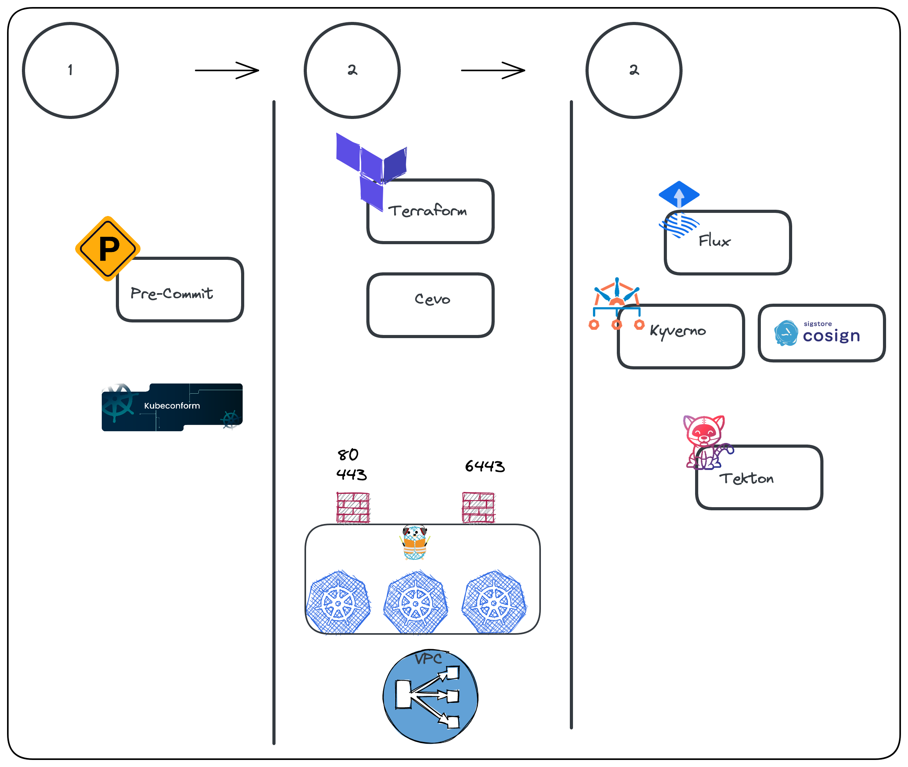

# DevSecOps Toolkit on a budget
This repo houses a quickstart for bootstrapping a DevSecOps k8s stack

## Step 1
- fork the repo
## Step 2
Set up Civo  and mark down your api key
1. this code was taken as a template from (here)[https://github.com/civo/terraform-template]

## Step 3
```bash
cd civo/cluster-deploy
terraform plan
terraform apply --auto approve
```
*NOTE*
- i ran into issues with the node auto upgrading and had to untaint the k8s object and re-run the apply
- Your kube context  will be called `tf-template-cluster`  be sure to set that before going to the next step
# Step 4
Install Flux
1. will need a githip PAT token, docs on installing flux can be found (here)[https://fluxcd.io/flux/installation/]
```
export GITUSER=<githubusername>
./scripts/bootstrap/flux-bootstra.sh
```

Architecture


